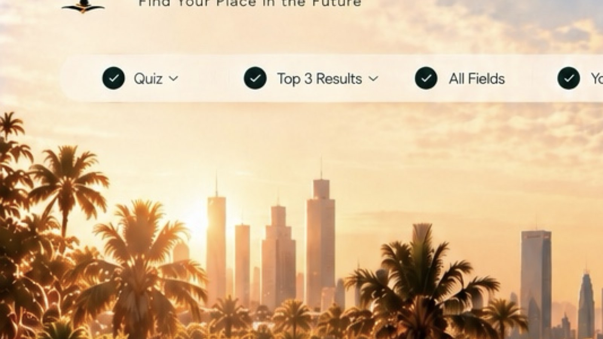

# 2030 Compass

## What it does
It takes a student's quiz answers and gives personalized Vision 2030 career-field recommendations.

## Who it is for
Students and young professionals exploring future career paths in Saudi Arabia.

## Needs
Nothing but a browser.

## How to run it
### Windows
1. Download and extract this repository.
2. Open `index.html` in a modern browser.

### Mac
1. Download and extract this repository.
2. Open `index.html` in a modern browser.

## Try it with the sample data
1. Open `sample-data/example-quiz-answers.txt`.
2. Open `index.html` in your browser and select **Start My 2030 Journey**.
3. Choose the corresponding answer from the sample file for each of the 10 questions.
4. Select **See My Results**. You should see Technology & Digital as the top field, along with the other result pages.
5. On the **Your 2030** page, select **Download Result Card** to save a PNG result card.

## If the app makes a file or image, one example of it in sample-data
The app creates a PNG called `2030-compass-result-card.png` when you select **Download Result Card**. `sample-data/example-2030-passport.jpg` is a small made-up example result card, and `sample-data/example-quiz-answers.txt` contains the matching example answers.

## Built with Claude Code during the KKU Claude Code hackathon
Built with Claude Code during the KKU Claude Code hackathon.
